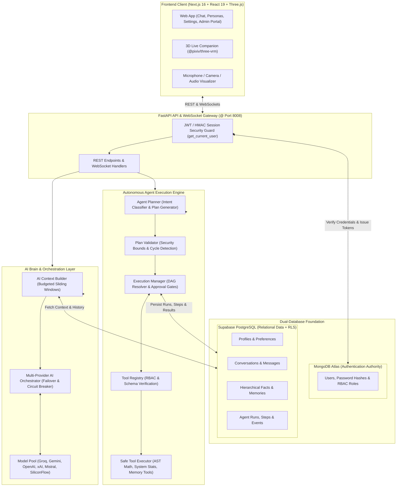

# 🤖 Sarala AI (सरला) — Aapki AI Dost
### *Next-Generation Multimodal AI Companion, Multi-LLM Orchestrator, Autonomous Agent Planning Engine & Dual-Database Intelligence Platform*

[](https://nextjs.org/)
[](https://react.dev/)
[](https://fastapi.tiangolo.com/)
[](https://python.org/)
[](https://mongodb.com/)
[](https://supabase.com/)
[](https://threejs.org/)
[](https://tailwindcss.com/)
[](LICENSE)

---

## 🌟 Overview

**Sarala AI (सरला)** is a production-grade, multimodal AI companion and autonomous agent execution platform designed to think, plan, remember, and interact naturally in Hindi, English, and *Hinglish*. 

Unlike traditional chatbot wrappers, Sarala AI integrates:
1. **Interactive 3D VRM Avatar Companion**: Real-time facial emotion synthesis, procedural head gestures, and audio viseme lip-syncing over live video calls.
2. **Dual-Database Architecture**: Secure decoupling of MongoDB Atlas (authoritative user authentication, credential security, RBAC) and Supabase PostgreSQL (relational application data, message history, user memories, and agent run states).
3. **Multi-Provider AI Orchestration Layer**: Dynamic multi-model load balancing and failover across Groq (Llama-3.3 70B & GPT-OSS-120B), Google Gemini 2.5 Flash, OpenAI GPT-4o, xAI Grok-beta, Mistral Large, and SiliconFlow.
4. **Autonomous Agent Planning & Execution Engine**: Controlled multi-step planning, dependency-graph DAG resolution, AST-guarded tool execution, human-in-the-loop approval gates, state persistence, and pause/resume capabilities.
5. **Hierarchical Long-Term Memory Engine**: Automatic extraction of personal facts, preferences, and entity memories with dynamic importance decay and semantic context injection.

---

## 🏛️ System Architecture



---

## ✨ Key Capabilities & Systems

### 1. 🎭 3D Interactive VRM Live Video Companion
- **Real-Time 3D Video Calls**: Animated 3D companion rendered via `@pixiv/three-vrm` in a Three.js canvas.
- **Emotion & Expression Controller**: Procedurally blends 5 distinct emotional states (Happy, Surprised, Thinking, Empathetic, Shy) synchronized with conversation sentiment.
- **Dynamic Viseme Lip-Sync**: Converts real-time audio frequencies into mouth blendshapes (`A`, `I`, `U`, `E`, `O`) with procedural eye blinking and head tilting.
- **Picture-in-Picture Webcam**: Live user camera PiP with real-time audio waveform visualizers.

### 2. 🧠 Adaptive 3-Persona Engine
Seamlessly switch conversational tone and operational behavior on the fly:
- **`normal` (Everyday Assistant)**: Balanced, friendly, warm, and highly capable daily assistant.
- **`love` (Empathetic Companion & Partner)**: Affectionate, caring, and deeply emotionally attuned companion while preserving full intellect and assistant abilities.
- **`expert` (Deep Work & Engineering)**: Rigorous, precise, technical architect mode focused on software engineering, system design, debugging, and analytical rigor.

### 3. 🤖 AI Agent Planning & Execution Engine (Task 1.9)
- **Controlled Intent Discrimination**: Simple queries ("What is Python?") bypass the agent engine for sub-second latency; complex, multi-action workflows automatically trigger structured planning.
- **DAG Dependency Graph**: Plans multi-step sequences where dependent steps consume outputs from prior steps using template substitution (`{{step_1.result}}`).
- **Plan Validation & Security Gates**: Pre-execution verification checks tool availability, detects circular dependencies, and validates input schemas.
- **Human-in-the-Loop Approval**: Risky or write-intensive steps pause execution in `waiting_for_approval` state until explicitly approved or rejected by the user.
- **Pause, Resume & Cancel**: Thread-safe mutexes allow pausing active runs and resuming from the exact pending step.
- **Persistent Execution State**: Agent runs (`agent_runs`), steps (`agent_steps`), and audit events (`agent_events`) are persisted in Supabase with user isolation.

### 4. 🛠️ Backend Tool Registry & Execution Layer (Task 1.8)
- **Centralized Tool Registry**: Strict validation of tool manifests, JSON schemas, and argument types.
- **Role-Based Execution Isolation**: Admin-only tools (e.g., `get_system_stats`) cannot be discovered or invoked by standard users.
- **AST-Based Math Evaluator**: Safe arithmetic computation without `eval()` or code execution vulnerabilities.
- **User-Scoped Tools**: User profile, preferences, and memory tools automatically inject the authenticated `user_id`.

### 5. 🌐 Multi-Provider AI Orchestration (Task 1.7)
- **Universal Provider Adapters**: Provider-neutral interfaces for Groq, Google Gemini, OpenAI, xAI Grok, Mistral, and SiliconFlow.
- **Automatic Fallback Cascades**: If primary provider (Groq) experiences rate limits or outages, requests automatically cascade to secondary providers with zero end-user interruption.
- **Telemetry & Circuit Breakers**: Tracks token usage, latency, and error rates to prevent cascading failure.

### 6. 📚 Long-Term Memory & Context Builder (Tasks 1.5 & 1.6)
- **Fact Extraction**: Automatically captures user facts, identity parameters, and preferences from normal conversation.
- **Importance & Recency Scoring**: Queries retrieve the most relevant memories within allocated token budgets.
- **Deterministic Token Budgeting**: Enforces strict character and token limits (`max_history_chars=8000`, `response_token_budget=800`) across all model interactions.

### 7. 🗄️ Dual-Database Architecture & User Isolation
- **Authentication Authority (MongoDB Atlas)**: Stores user credentials, salted PBKDF2-HMAC-SHA256 password hashes, active sessions, and roles.
- **Application Data (Supabase PostgreSQL)**: Profiles, preferences, conversations, messages, user memories, and agent run states.
- **Zero-Trust User Isolation**: All relational tables reference the canonical MongoDB `user_id`. Cross-user data access is blocked at both database (RLS) and API gateway layers.

---

## 📁 Repository Structure

```
sarala-ai/
├── package.json                   # Root workspace orchestrator (concurrent dev)
├── README.md                      # Complete project documentation
├── TEST_SUMMARY.md                # Task 1.10 End-to-End QA and Browser Test Report
│
├── 📖 Architecture Documentation:
│   ├── AUTHENTICATION_ARCHITECTURE.md   # MongoDB Auth & RBAC specification
│   ├── DUAL_DATABASE_ARCHITECTURE.md    # MongoDB + Supabase integration
│   ├── PERSISTENT_DATA_API_ARCHITECTURE.md # CRUD API & user isolation
│   ├── CHAT_PERSISTENCE_ARCHITECTURE.md # Conversations & message timeline
│   ├── MEMORY_ENGINE_ARCHITECTURE.md    # Fact extraction & retrieval engine
│   ├── AI_CONTEXT_ARCHITECTURE.md       # Dynamic context & token budgeting
│   ├── AI_PROVIDER_ARCHITECTURE.md      # Multi-LLM adapter & fallback system
│   ├── TOOL_EXECUTION_ARCHITECTURE.md   # Tool Registry & security guards
│   └── AGENT_EXECUTION_ARCHITECTURE.md  # Multi-step Agent Engine specification
│
├── backend/                       # Python FastAPI Backend (@ Port 8008)
│   ├── ai/                        # AI Core Services
│   │   ├── agent/                 # Agent Engine (Planner, Validator, Manager, Repo)
│   │   ├── providers/             # LLM Adapters (Groq, Gemini, OpenAI, etc.)
│   │   ├── tools/                 # Tool Registry, Executor & Implementations
│   │   ├── orchestrator.py        # Central AI Multi-Model Orchestrator
│   │   └── registry.py            # Model Registry & Configurations
│   ├── core/                      # Application Services & Middleware
│   │   ├── auth.py                # Security dependencies (get_current_user)
│   │   ├── brain.py               # Multimodal brain orchestrator
│   │   ├── mongodb_client.py      # MongoDB Atlas client & token verification
│   │   ├── supabase_client.py     # Supabase connection manager
│   │   └── services/              # Domain Services (Profile, Memory, Message, etc.)
│   ├── web/
│   │   └── app.py                 # FastAPI application, CORS & REST routing
│   ├── migrations/                # Database migration scripts
│   ├── supabase_schema.sql        # Supabase PostgreSQL schema with RLS (Sections 1-10)
│   └── requirements.txt           # Python backend dependencies
│
├── frontend/                      # Next.js 16 App Router Frontend (@ Port 3000)
│   ├── src/
│   │   ├── app/                   # App Router pages (Home, Chatbot, Settings, Admin)
│   │   ├── components/            # UI Components & 3D VRM Live Companion
│   │   ├── context/               # AuthContext & Session management
│   │   └── lib/                   # API clients & Supabase browser client
│   └── package.json               # Frontend dependencies
│
└── qa/                            # Structured QA Artifacts
    ├── issues.json                # Discovered issues, root causes & recommendations
    └── test-results.json          # Machine-readable dataset of all 44 test cases
```

---

## ⚡ Quick Start Guide

### Prerequisites
- **Node.js**: v18.0.0 or later (v20+ recommended)
- **Python**: v3.11 or later
- **MongoDB Atlas**: Cluster connection URI
- **Supabase**: PostgreSQL project URL and service/anon keys

---

### 1. Installation

```bash
# Clone the repository
git clone https://github.com/lwavee/sarala-ai.git
cd sarala-ai

# Install root dependencies
npm install

# Install frontend dependencies
npm --prefix frontend install

# Set up Python virtual environment (Windows)
python -m venv backend/venv
backend\venv\Scripts\activate
pip install -r backend/requirements.txt

# Or for macOS/Linux:
# python3 -m venv backend/venv
# source backend/venv/bin/activate
# pip install -r backend/requirements.txt
```

---

### 2. Environment Configuration

#### Backend Configuration (`backend/.env`):
```env
# MongoDB Atlas (Authentication Authority)
MONGODB_URI="mongodb+srv://<username>:<password>@<cluster>.mongodb.net/sarala_ai?retryWrites=true&w=majority"
MONGODB_DB_NAME="sarala_ai"

# Supabase (PostgreSQL Application Data)
SUPABASE_URL="https://<project-ref>.supabase.co"
SUPABASE_KEY="<publishable-or-service-key>"

# AI Provider API Keys
GROQ_API_KEY="gsk_..."
GEMINI_API_KEY="AIzaSy..."
OPENAI_API_KEY="sk-..."
XAI_API_KEY="xai-..."
MISTRAL_API_KEY="..."

# Agent Planning & Execution Settings
AGENT_ENABLED=true
AGENT_MAX_STEPS=15
AGENT_MAX_TOOL_CALLS=25
AGENT_MAX_RUNTIME_SECONDS=300.0
AGENT_MAX_RETRIES=2
AGENT_MAX_RESULT_SIZE=32768
```

#### Frontend Configuration (`frontend/.env.local`):
```env
NEXT_PUBLIC_API_URL=http://localhost:8008
NEXT_PUBLIC_SUPABASE_URL=https://<project-ref>.supabase.co
NEXT_PUBLIC_SUPABASE_ANON_KEY=<publishable-anon-key>
```

---

### 3. Initialize Database Schema

Execute [`backend/supabase_schema.sql`](backend/supabase_schema.sql) in your **Supabase SQL Editor** to initialize all 10 core schema sections:
1. Profiles (`profiles`)
2. User Preferences (`user_preferences`)
3. Conversations (`conversations`)
4. Messages (`messages`)
5. Memories (`user_memories`)
6. Files (`user_files`)
7. Knowledge Base (`admin_knowledge`)
8. System Audit Logs (`system_audit_logs`)
9. Tool Executions (`tool_executions`)
10. Agent Engine (`agent_runs`, `agent_steps`, `agent_events`)

---

### 4. Running the Application

Start both the backend and frontend concurrently:

```bash
npm run dev
```

| Service | Address | Description |
| :--- | :--- | :--- |
| **Frontend Web App** | [http://localhost:3000](http://localhost:3000) | Next.js 16 Web Application |
| **Backend REST & WS** | [http://localhost:8008](http://localhost:8008) | FastAPI Server |
| **Interactive API Docs**| [http://localhost:8008/docs](http://localhost:8008/docs) | Swagger UI Documentation |

---

## 🧪 Comprehensive Verification & Test Suites

Sarala AI maintains a 100% verified test suite covering all architecture milestones:

```bash
# Activate your backend environment
backend\venv\Scripts\activate

# 1. End-to-End QA & Live System Test Suite (Task 1.10 - 44 test cases)
python backend/test_task_1_10_qa.py

# 2. AI Agent Planning & Execution Engine Suite (Task 1.9 - 79 test cases)
python backend/test_task_1_9_agent.py

# 3. Tool Registry & Tool Execution Suite (Task 1.8 - 138 test cases)
python backend/test_task_1_8_tools.py

# 4. Multi-Provider AI Orchestration Suite (Task 1.7 - 132 test cases)
python backend/test_task_1_7_orchestration.py

# 5. AI Context Builder & Token Budgeting Suite (Task 1.6)
python backend/test_task_1_6_context.py

# 6. Memory Extraction & Long-Term Memory Suite (Task 1.5)
python backend/test_task_1_5_memory.py

# 7. Chat & Message Persistence Suite (Task 1.4)
python backend/test_task_1_4_chat.py

# 8. Persistent User Data APIs Suite (Task 1.3)
python backend/test_task_1_3_apis.py

# 9. Dual-Database Architecture & Isolation Suite
python backend/test_dual_database.py
```

---

## 🔐 Security & Governance

- **Zero-Trust Token Validation**: Session tokens are cryptographically validated against MongoDB identity records.
- **Admin Privilege Isolation**: Protected operations (`/api/admin/*`, `get_system_stats` tool) require explicit `role="admin"` verification. Client-supplied headers cannot escalate privileges.
- **Cross-User Data Isolation**: Every database query and tool operation is scoped to `user_id = current_user.user_id`. Cross-user access returns HTTP 403 Forbidden.
- **No Arbitrary Code Execution**: Mathematical evaluation uses Python AST parsing; no `eval()`, `exec()`, or subshell execution exists.
- **Secret Redaction**: API keys, password hashes, and session secrets are automatically scrubbed from logs and client responses.

---

## 👥 Contributors & Author

- **Naveen Panchal (Avee)** — *Creator & Lead Architect*
  - Contact: [loharavee@gmail.com](mailto:loharavee@gmail.com)
  - GitHub: [@lwavee](https://github.com/lwavee)

---

## 📄 License

This project is licensed under the **MIT License** — see the [LICENSE](LICENSE) file for details.
