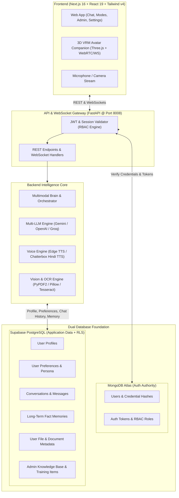

# 🤖 Sarala AI (सरला) — Aapki AI Dost
### *Next-Generation Multimodal AI Assistant, 3D Live Companion & Dual-Database Intelligence Platform*

[](https://nextjs.org/)
[](https://react.dev/)
[](https://fastapi.tiangolo.com/)
[](https://python.org/)
[](https://mongodb.com/)
[](https://supabase.com/)
[](https://threejs.org/)
[](https://tailwindcss.com/)
[](LICENSE)

---

## 🌟 Overview

**Sarala AI (सरला)** is a comprehensive, production-ready AI companion and multimodal intelligence platform designed to think, learn, remember, and interact naturally in both Hindi and English (*Hinglish*).

Combining a **3D animated VRM avatar video-calling companion**, a **dual-database architecture** (MongoDB Atlas + Supabase PostgreSQL), multi-LLM orchestration (Gemini, OpenAI, Groq), a custom Hindi voice cloning engine, and an enterprise administrative training suite, Sarala delivers an intimate, intelligent, and highly personalized conversational experience.

---

## 🏛️ System Architecture

Sarala AI utilizes a decoupled, high-performance architecture separating authentication authority from structured application data:



---

## ✨ Core Features

### 1. 🎭 3D Interactive VRM Live Video Companion
- **Real-Time 3D Video Call**: Live avatar companion powered by `@pixiv/three-vrm` and Three.js.
- **Emotion & Expression Controller**: Dynamically expresses emotions (happy, surprised, thinking, empathetic, shy) synchronized with conversational sentiment.
- **Natural Lip Sync & Head Gestures**: Real-time viseme mapping based on audio frequency and procedural head nods, tilts, and eye blinking.
- **Interactive Camera PiP**: User webcam picture-in-picture view during live calls with audio visualizer animations.

### 2. 🎙️ Natural Voice Engine & Speech Synthesis
- **Bilingual Hindi & English Speech**: Fluid pronunciations tailored for conversational Hinglish.
- **Multi-Provider Voice Pipeline**:
  - **Chatterbox**: Natural Hindi voice cloning.
  - **Edge TTS**: High-speed, low-latency multilingual streaming.
  - **In-Memory Streaming**: Zero-disk overhead audio byte streaming for instant audio playback.

### 3. 🧠 Adaptive Persona Engine (3 Distinct Modes)
Switch personalities seamlessly across conversations without losing capability:
- **`normal` (Everyday Assistant)**: Warm, helpful, balanced, and friendly daily guide.
- **`love` (Empathetic Companion & Partner)**: Affectionate, caring, and emotionally attuned companion while preserving full assistant capabilities.
- **`expert` (Deep Work & Engineering)**: Technical, precise, system-level architecture, debugging, and analytical execution.

### 4. 🗄️ Dual-Database Architecture & Strict Isolation
- **MongoDB Atlas**: Serves as the authoritative source for user authentication, password hashing/salting, session tokens, and RBAC verification.
- **Supabase (PostgreSQL with RLS)**: Manages relational application data including user profiles, preferences, conversations, message timelines, user-scoped memories, and file metadata.
- **Strict Data Isolation**: Every entity is isolated by `user_id`. Cross-user access is blocked at both database and application service layers.

### 5. 📚 Long-Term Memory & Fact Retrieval
- Extracts personal details, preferences, and recurring facts into key-value memory records.
- Automatically injects relevant user facts into context for hyper-personalized conversations.

### 6. 🛡️ Enterprise Admin Control Center
- **User Management**: View user registries, toggle accounts, and monitor user activity.
- **AI Training & Knowledge Base**: Upload PDFs, ingest enterprise documents, create training Q&A chunks, and benchmark models.
- **System Telemetry**: Real-time database connection statuses, response latency, and system health checks.

---

## 📁 Repository Structure

```
sarala-ai/
├── package.json                   # Root workspace orchestrator (concurrent dev)
├── AUTHENTICATION_ARCHITECTURE.md # Authentication architecture specification
├── README.md                      # Project documentation
│
├── backend/                       # Python FastAPI Backend
│   ├── core/                      # Application core services & engine
│   │   ├── admin_service.py       # Admin training and knowledge management
│   │   ├── auth.py                # Authentication dependencies & security guards
│   │   ├── brain.py               # Core orchestrator and multimodal brain
│   │   ├── llm.py                 # Multi-provider LLM connector (Gemini/OpenAI/Groq)
│   │   ├── mongodb_client.py      # MongoDB Atlas client & token verification
│   │   ├── supabase_client.py     # Supabase client & connection manager
│   │   └── services/              # Domain-driven database services
│   │       ├── conversation_service.py
│   │       ├── memory_service.py
│   │       ├── message_service.py
│   │       ├── preferences_service.py
│   │       ├── profile_service.py
│   │       └── user_file_service.py
│   ├── voice/                     # Voice synthesis, cloning, and streaming
│   │   ├── chatterbox_online.py   # Chatterbox Hindi TTS provider
│   │   ├── natural_voice.py       # Voice cleaner and manager
│   │   └── voice_service.py       # Fast TTS synthesis & audio streaming
│   ├── web/
│   │   └── app.py                 # FastAPI application and route declarations
│   ├── supabase_schema.sql        # Supabase PostgreSQL schema with RLS & indexes
│   ├── test_dual_database.py      # End-to-end dual database test suite
│   ├── test_modes.py              # Persona engine verification tests
│   ├── test_persistence_and_voice.py # Persistence and audio test suite
│   └── requirements.txt           # Python backend dependencies
│
└── frontend/                      # Next.js 16 App Router Frontend
    ├── src/
    │   ├── app/                   # App Router pages
    │   │   ├── page.tsx           # Home / Landing page
    │   │   ├── chatbot/           # Interactive chat & multimodal interface
    │   │   ├── admin/             # Administrator dashboard & training suite
    │   │   ├── agents/            # Specialized task agents interface
    │   │   └── settings/          # User preferences & theme customization
    │   ├── components/
    │   │   ├── live/              # 3D VRM Avatar companion & video calling
    │   │   │   ├── AvatarController.ts   # VRM bones, blinks, and poses
    │   │   │   ├── EmotionController.ts  # Facial expression blendshapes
    │   │   │   ├── LipSyncController.ts  # Audio frequency to viseme converter
    │   │   │   ├── SaralaAvatar3D.tsx    # Three.js canvas & render loop
    │   │   │   ├── UserCameraPip.tsx     # Webcam picture-in-picture component
    │   │   │   └── useLiveSession.ts     # Live WebRTC/WebSocket hook
    │   │   └── layout/            # Navigation, header, sidebar & layout elements
    │   └── lib/                   # API clients, admin utilities & Supabase client
    ├── public/                    # Static models, avatars, and audio samples
    └── package.json               # Frontend dependencies
```

---

## ⚡ Quick Start

### Prerequisites
- **Node.js**: v18.0.0 or later
- **Python**: v3.11 or later
- **MongoDB Atlas**: Cluster URI with read/write privileges
- **Supabase**: Project URL and Anon/Publishable Key

---

### 1. Installation

Clone the repository and install all dependencies:

```bash
# Clone the repository
git clone https://github.com/lwavee/sarala-ai.git
cd sarala-ai

# Install root dependencies (concurrent runner)
npm install

# Install frontend dependencies
npm --prefix frontend install

# Set up Python virtual environment (Windows)
python -m venv backend/venv
backend\venv\Scripts\activate
pip install -r backend/requirements.txt

# Or for macOS/Linux:
# python3 -m venv backend/venv
# source backend/venv/bin/activate
# pip install -r backend/requirements.txt
```

---

### 2. Initialize the Database Schema

Run the SQL script [`backend/supabase_schema.sql`](backend/supabase_schema.sql) in your **Supabase SQL Editor** to create the required tables, foreign keys, indexes, and Row-Level Security policies.

---

### 3. Running the Application

Run both the Backend API and Frontend concurrently with a single command from the project root:

```bash
npm run dev
```

| Service | Local URL | Description |
| :--- | :--- | :--- |
| **Frontend Web App** | [http://localhost:3000](http://localhost:3000) | Next.js 16 Web Application |
| **Backend REST & WS** | [http://localhost:8008](http://localhost:8008) | FastAPI Server |
| **Interactive API Docs**| [http://localhost:8008/docs](http://localhost:8008/docs) | Swagger UI Documentation |

You can also run services independently:
```bash
# Run only backend
npm run dev:backend

# Run only frontend
npm run dev:frontend
```

---

## 🧪 Testing & Verification

Sarala AI includes automated test suites covering dual database sync, personas, voice streaming, and security:

```bash
# Activate your backend environment
backend\venv\Scripts\activate

# 1. Verify Dual Database Architecture (MongoDB + Supabase sync & isolation)
python backend/test_dual_database.py

# 2. Verify Persona Engine (Normal, Love, and Expert modes)
python backend/test_modes.py

# 3. Verify Memory Persistence & Voice Engine
python backend/test_persistence_and_voice.py

# 4. Type check with Pyright
npx pyright backend/test_dual_database.py
```

---

## 🔐 Security & Role-Based Access Control (RBAC)

- **Strict Identity Anchor**: The MongoDB `user_id` serves as the single source of truth across all sessions and Supabase foreign keys.
- **Server-Side Role Guarding**: Role escalation is strictly prevented; client tokens cannot forge `admin` privileges.
- **User Data Isolation**: Queries for conversations, messages, preferences, and files are strictly scoped to the authenticated user ID.

---

## 👥 Contributors & Author

- **Naveen Panchal (Avee)** — *Creator & Lead Architect*
  - Contact: [loharavee@gmail.com](mailto:loharavee@gmail.com)
  - GitHub: [@lwavee](https://github.com/lwavee)

---

## 📄 License

This project is licensed under the **MIT License** — see the [LICENSE](LICENSE) file for details.
